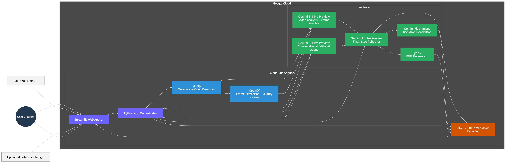

# 🖤 AI Visual Zine Editor

AI Visual Zine Editor is an interactive publishing tool that turns public YouTube videos into curated, magazine-style digital issues.

It analyzes a video with Gemini, extracts candidate frames locally, lets the user refine the editorial angle through chat and uploaded reference images, and publishes the result as a stylized webzine with optional soundtrack generation and export to **HTML**, **PDF**, and **Markdown**.

## Why this project

A lot of multimodal demos can summarize a video. Far fewer can turn that material into something that feels **edited**, **authored**, and **publishable**.

This project is built around that gap. Instead of treating the model as a one-shot summarizer, it treats Gemini as a collaborative editorial partner that can:

- read a public YouTube video as source material
- identify representative visual moments
- support a back-and-forth editorial conversation
- incorporate user-uploaded reference images
- publish a designed magazine-style artifact

The goal is to move from **analysis** to **creative editorial production**.

## Core features

### 1. Public YouTube video analysis

The app accepts a public YouTube URL and uses Gemini to:

- classify the source material
- generate a clean display title
- produce a structured editorial reading
- suggest candidate timestamps for representative frames

### 2. Automatic frame extraction and curation

A local media pipeline uses:

- `yt-dlp` for metadata and video retrieval
- OpenCV for frame extraction and quality scoring

The app then selects a compact editorial frame set for the issue layout.

### 3. Conversational editorial collaboration

Inside the conversation tab, the user can refine the current interpretation with the model as a co-editor.

That can include:

- symbolism and thematic reading
- comparisons to related works or eras
- visual grammar analysis
- ideological or theoretical framing
- layout emphasis and editorial direction

These conversation turns carry forward into the final publishing stage.

### 4. User-uploaded reference images

The user can attach their own images during the conversation. Those images are:

- available as context during the editorial dialogue
- treated as valid layout assets during publishing
- included in the final issue with labels and captions

### 5. Final issue publishing

When the user publishes the issue, the app generates:

- an issue title
- a deck
- a cover line
- a pull quote
- long-form editorial text
- frame captions
- uploaded-image captions
- multi-page export content

### 6. Optional media generation

The issue can also generate:

- a decorative backdrop image using the Gemini Flash Image family
- an instrumental soundtrack using Lyria 2

For music generation, the app first distills editorial intent into a safer generic mood blueprint before sending it to the music model.

### 7. Multi-format export

The final issue can be exported as:

- **Markdown**
- **HTML**
- **PDF**

The PDF is designed as a magazine-style layout rather than a plain text printout.

## Quick start

### Prerequisites

- Python 3.9+
- A Google Cloud project with Vertex AI enabled
- Google Cloud authentication through Application Default Credentials
- WeasyPrint system dependencies if you want PDF export

### Installation

```bash
git clone https://github.com/kim-chair/ai-visual-zine-editor.git
cd ai-visual-zine-editor
pip install -r requirements.txt

# Authenticate with Google Cloud
gcloud auth application-default login

# Run the app
streamlit run app.py
```

If `streamlit` is not available on your `PATH`, run:

```bash
python -m streamlit run app.py
```

### Configure Google Cloud

The current code keeps Google Cloud settings directly in `app.py`.
Before running on your own project, update these constants:

- `PROJECT_ID`
- `LOCATION`
- `LYRIA_LOCATION`

## Tech stack

### App layer

- Streamlit

### Media processing

- `yt-dlp`
- OpenCV
- Pillow

### AI and cloud

- Vertex AI
- Google Gen AI SDK
- Gemini for video analysis, editorial chat, publishing, and music blueprinting
- Gemini Flash Image family for decorative backdrop generation
- Lyria 2 for optional soundtrack generation

### Export

- HTML/CSS
- WeasyPrint for PDF rendering

## Current model configuration

As currently configured in the repository:

- `gemini-3.1-pro-preview` for video analysis, conversational editing, issue generation, and music-prompt blueprinting
- `gemini-3.1-flash-image`, `gemini-3.1-flash-image-preview`, and `gemini-2.5-flash-image` as a fallback chain for decorative backdrop generation
- `lyria-002` for optional music generation

## Architecture



High-level flow:

1. The user submits a public YouTube URL.
2. The Streamlit app fetches metadata and analyzes the source with Gemini.
3. `yt-dlp` downloads the video locally and OpenCV scores candidate frames.
4. The model selects the editorial frame set.
5. The conversation layer refines the critical angle and can ingest uploaded reference images.
6. The publishing layer generates issue text, captions, and layout content.
7. Optional media generation produces a decorative backdrop and soundtrack.
8. The exporter writes HTML, PDF, and Markdown outputs.

## Why this counts as multimodal and agentic

This is not just a single prompt wrapped in a UI.

The system:

- interprets multimodal video input
- proposes editorial structure
- accepts follow-up human guidance
- incorporates new visual evidence
- publishes a cohesive artifact combining text, image, and optional audio

## Cost notes

This project is **usage-priced** through Google Cloud Vertex AI.
There is no single fixed per-run cost because total usage depends on:

- source video length
- number of editorial chat turns
- number of uploaded reference images
- whether decorative image generation is enabled
- whether soundtrack generation is enabled

A single issue usually involves several model calls rather than one request.
For demos, hackathons, or public deployment, treat cost as variable and check current Vertex AI pricing before estimating per-issue spend.

A practical deployment tip: set quotas, budgets, and spending alerts before exposing the app publicly.

## Learnings

Some practical lessons from building this project:

- **The best multimodal UX is staged.** Separating analysis, conversation, and publication created a more understandable and stable workflow.
- **User-uploaded images improve grounding.** When users can attach their own images, the editorial conversation becomes more concrete and the final layout feels more intentional.
- **Music prompting benefits from abstraction.** Passing raw editorial text into music generation is less reliable than first distilling it into generic stylistic descriptors.

## Limitations

- Works best with public YouTube URLs and visually rich source material
- Processing time grows with video length, resolution, and the number of uploaded images
- Frame selection is heuristic and may miss the most editorially useful moment
- Background music generation depends on Lyria availability and may fail under quota or policy constraints
- PDF export depends on WeasyPrint and its system-level dependencies
- The PDF export is visual-only; interactive audio remains in the app and HTML export

## Suggested test flow

A solid demo run looks like this:

1. Paste a public YouTube music video or fashion-show URL.
2. Review the initial editorial analysis.
3. Upload a few reference images in the conversation tab.
4. Ask for a sharper editorial angle or layout emphasis.
5. Publish the final webzine.
6. Export the issue as HTML or PDF.

## License

This repository is released under the MIT License.
