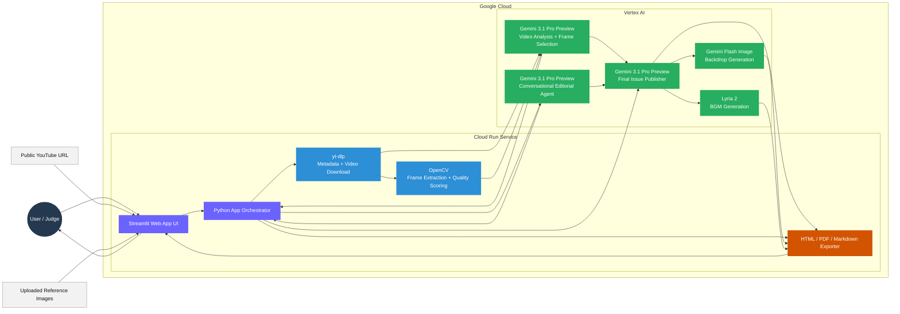

```mermaid
flowchart LR
  classDef user fill:#24384f,stroke:#24384f,stroke-width:2px,color:#fff;
  classDef frontend fill:#6c63ff,stroke:#6c63ff,stroke-width:2px,color:#fff;
  classDef processing fill:#2d8fd5,stroke:#2d8fd5,stroke-width:2px,color:#fff;
  classDef ai fill:#27ae60,stroke:#27ae60,stroke-width:2px,color:#fff;
  classDef output fill:#d35400,stroke:#d35400,stroke-width:2px,color:#fff;
  classDef ext fill:#f2f2f2,stroke:#999,stroke-width:1px,color:#111;

  U((User / Judge)):::user
  Y["Public YouTube URL"]:::ext
  X["Uploaded Reference Images"]:::ext

  subgraph GC["Google Cloud"]
    direction LR

    subgraph CR["Cloud Run Service"]
      direction LR
      UI["Streamlit Web App UI"]:::frontend
      ORCH["Python App Orchestrator"]:::frontend
      DL["yt-dlp<br/>Metadata + Video Download"]:::processing
      CV["OpenCV<br/>Frame Extraction + Quality Scoring"]:::processing
      EXP["HTML / PDF / Markdown Exporter"]:::output
    end

    subgraph VA["Vertex AI"]
      direction TB
      G1["Gemini 3.1 Pro Preview<br/>Video Analysis + Frame Selection"]:::ai
      G2["Gemini 3.1 Pro Preview<br/>Conversational Editorial Agent"]:::ai
      G3["Gemini 3.1 Pro Preview<br/>Final Issue Publisher"]:::ai
      GI["Gemini Flash Image<br/>Backdrop Generation"]:::ai
      LY["Lyria 2<br/>BGM Generation"]:::ai
    end
  end

  U --> UI
  Y --> UI
  X --> UI

  UI --> ORCH
  ORCH --> DL
  DL --> CV
  DL --> G1
  CV --> G1

  ORCH --> G2
  ORCH --> G3
  G1 --> ORCH
  G2 --> ORCH
  G1 --> G3
  G2 --> G3

  G3 --> GI
  G3 --> LY
  G3 --> EXP
  ORCH --> EXP
  GI --> EXP
  LY --> EXP

  EXP --> UI
  UI --> U
```
